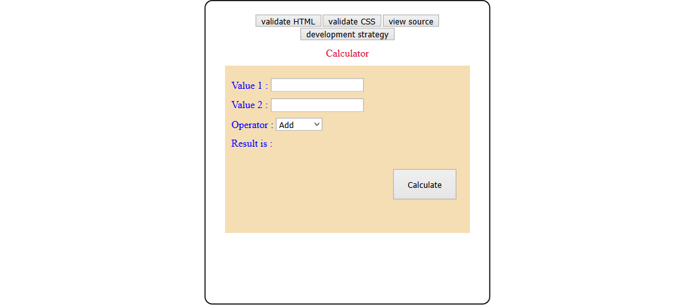

# calculator-refactor

## Table of contents
* [General info](#general-info)
* [Screenshots](#screenshots)
* [Technologies](#technologies)
* [Setup](#setup)
* [Features](#features)
* [Status](#status)
* [Inspiration](#inspiration)
* [Summary](#Summary)
* [Contact](#contact)

## General info
The motiviation of this project is to get more comfortable with java-script life cycle , adding listener and handelers and call-back functions , all along side with HTML and CSS . and get more comfortable with interactive design websites .

## Screenshots
This is a screen-shot of the final live demo of this project.

## Technologies
* HTML5 /CSS , Java-script .
## Setup
Clone the repository 
Open using Visual studio code ..
Explore...

## Features
The project is divided into many steps as user-stories , please read DevelopmentStrategy.md for more details about each user story,
Eech one of them is mapped to one branch as follows :

| _Step Name_                | User Story                                                                                                       | Changes in HTML                                                                                     | Changes in CSS                                             |
| -------------------------- | ---------------------------------------------------------------------------------------------------------------- | --------------------------------------------------------------------------------------------------- | ---------------------------------------------------------- |
| **add-html** | As a web developer I want to layout the basic folders for my projects so I can navigate correctly | an index with all required html tags  | an empty main `style.css` , an empty java-script files |
| **add-DOM**    | As a web developer Iwould like to add the needed ids to highlight the elements that I will use in the js files|changes in html tags with ids  |an empty main `style.css` and empty js files  |
| **add-listener**           | As a web developer I would like to add a listener for my calculate button so when i clicked it a calculation happens |no changes   | an empty main `style.css` and update listener.js file  |
| **add-handeler**             | As a web developer I would like to add a function to check  inputs and pass them to the logic js file| no chnages |no changes in the style.css , update the handeler.js file |
 | **add-Logic**             | As a web developer I would like to add the core logic of my calculator so I can have a completer operations for div , mul , add, min| no chnages |no changes in the style.css , update the Logic.js file |
 | **add-CSS**             | As a web developer I would like to add have a good style for my calculator| no chnages |major changes in  the style.css , no changes in th js files |
 

## Status
Project is: finished as it is for learninig purpose.

## Inspiration
 Based on the video of this tutorial from mmtuts.

## Contact
Created by Rasha Ali https://rashaali84.github.io/ - feel free to contact me over GitHub!

## Summary
 ## Here you are a summery of what I struggled with, what I learned, and what skills I need to practice further.

| __My Learning points__ | As a front-end developer I learned how to create a website from scratch using html,css and js .

| __Skills to be practiced more__ | As a web developer I get more comfortable in using git commands form git bash terminal and the right sequence of pushing and pulling and branching .Also I learned how writing user stories ahead to organize my work in the project, in addition to using java-script and html,css .

